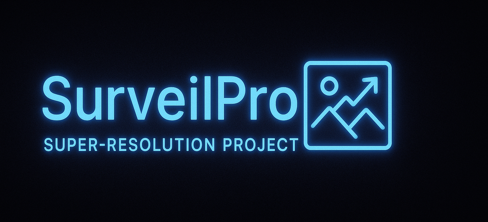

# SurveilPro

## About

SurveilPro is a mobile application that enhances image and video quality using advanced super-resolution AI models. The app processes media directly on your device, ensuring complete privacy and security of your data.

## Key Features

- **AI-Powered Super-Resolution**: Transform low-quality images and videos into high-resolution versions
- **On-Device Processing**: All processing happens locally - no data leaves your device
- **Lightweight Design**: Small app footprint with on-demand model downloads from GitHub
- **Visual Comparison**: Toggle between original and enhanced images to see the difference
- **Model Management**: Download, update, and share different super-resolution models

## How It Works

1. Select an image or video to enhance
2. Choose from available super-resolution models
3. Process the media on your device
4. View and save the enhanced result

## Technology Stack

- **Flutter** for cross-platform mobile development
- **TFLite** for on-device machine learning inference
- **Custom fine-tuned super-resolution models** converted from PyTorch to TFLite

## Screenshots

|                Original Image                |                Enhanced Result                | Model Selection |
|:--------------------------------------------:|:---------------------------------------------:|:---------------:|
|  |  |   Real-ESRGAN   |

## Contact

Gaurav Jha - [@gauravvjhaa](https://github.com/gauravvjhaa)
Raj Shakya - [@Rajshakya0101](https://github.com/Rajshakya0101)

